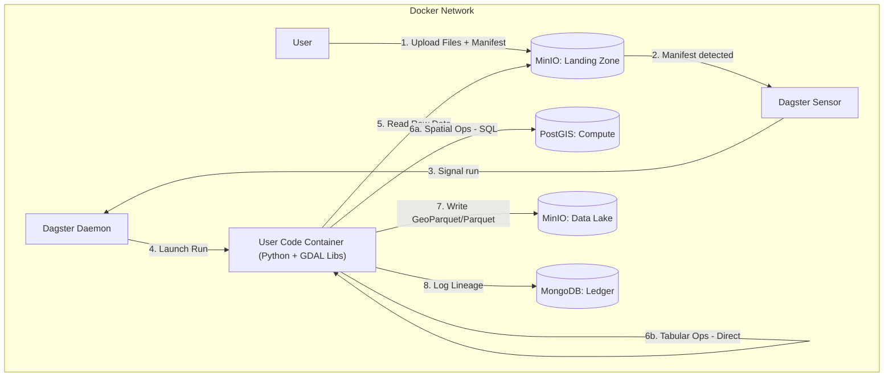

# data-etl-dagster — Agent Guide

## What this repo is / owns

This repo implements an offline-first Spatial Data ETL platform orchestrated by Dagster.
It ingests raw spatial and tabular files via a manifest protocol, uses PostGIS for transient compute (spatial only), stores outputs in MinIO (data lake), and records lineage/metadata in MongoDB (ledger).

## Key invariants / non-negotiables

- **Offline-first**: no public cloud dependencies at runtime.
- **Ledger**: MongoDB is the Source of Truth. No Mongo record = data doesn’t exist.
- **Persistence**: PostGIS is transient compute only. Never store permanent data there.
- **Isolation**: GDAL/heavy spatial libs live only in the `user-code` container.
- **Ingestion contract**: write to `landing-zone` → process → write to `data-lake`. No direct writes to the lake.
- **Tabular processing**: Tabular data (CSV) is processed directly to Parquet without PostGIS. Headers are cleaned to valid Postgres identifiers for reliable joins.

## Entry points / key files

- **Docker orchestration**: `docker-compose.yaml`
- **Dagster user code**: `services/dagster/etl_pipelines/`
- **Dagster definitions**: `services/dagster/etl_pipelines/definitions.py` (register assets/jobs/sensors here)
- **Shared libraries**: `libs/`
- **Tests**: `tests/`

## Architecture (high level)



## Ingestion contract (manifest protocol)

### Buckets

- `s3://landing-zone/`: raw uploads + manifests (ephemeral)
- `s3://data-lake/`: processed outputs (permanent)

### Asset partitioning (dataset_id)

The asset graph is **partitioned by `dataset_id`** using Dagster dynamic partitions (`DynamicPartitionsDefinition`).

- **Partition key source**: `metadata.tags.dataset_id` if present and non-blank; otherwise the system generates `dataset_{uuid12}`.
- **Why**: enables per-dataset materialization tracking and fan-in patterns (e.g., join assets depending on multiple upstream datasets).

### Upload sequence

1. Upload raw files to a batch prefix (example: `s3://landing-zone/batch_XYZ/...`).
2. Upload a manifest JSON to `s3://landing-zone/manifests/<batch_id>.json`.

### Manifest schema (current)

```json
{
  "batch_id": "unique_batch_identifier",
  "uploader": "user_or_system_id",
  "intent": "ingest_vector",
  "files": [
    {
      "path": "s3://landing-zone/batch_XYZ/input.geojson",
      "type": "vector",
      "format": "GeoJSON"
    }
  ],
  "metadata": {
    "project": "ALPHA",
    "description": "User supplied context",
    "tags": {
      "dataset_id": "dataset_ab12cd34ef56",
      "priority": 1,
      "source": "user",
      "published": false
    },
    "join_config": {
      "target_asset_id": "dataset_ab12cd34ef56",
      "left_key": "parcel_id",
      "right_key": "parcel_id",
      "how": "left"
    }
  }
}
```

**Alternative: Tabular Ingestion**

```json
{
  "batch_id": "unique_batch_identifier_tab",
  "uploader": "user_or_system_id",
  "intent": "ingest_tabular",
  "files": [
    {
      "path": "s3://landing-zone/batch_XYZ/data.csv",
      "type": "tabular",
      "format": "CSV"
    }
  ],
  "metadata": {
    "project": "ALPHA",
    "tags": { "dataset_id": "dataset_ab12cd34ef56" }
  }
}
```

- The `intent` selects a transformation recipe or processing lane:
  - **Spatial intents** (e.g., `ingest_vector`, `ingest_building_footprints`): Route to spatial pipeline using PostGIS
  - **Tabular intent** (`ingest_tabular`): Routes to tabular pipeline (CSV → Parquet, no PostGIS)
  - Unknown spatial intents fall back to the default recipe
  
### Sensor responsibilities (legacy + asset-based)

- **`manifest_sensor` (legacy)**: triggers op-based `ingest_job` for non-tabular, non-join intents (backwards compatibility).
- **`spatial_sensor`**: triggers asset-based `spatial_asset_job` for `intent in {"ingest_vector","ingest_raster"}` to materialize `raw_spatial_asset`.
- **`tabular_sensor`**: triggers asset-based `tabular_asset_job` for `intent == "ingest_tabular"` to materialize `raw_tabular_asset`.
- **`join_sensor`**: triggers `join_asset_job` for `intent == "join_datasets"` to materialize `joined_spatial_asset` (requires `metadata.join_config.target_asset_id`).
- Vector geometry column is standardized to `geom` in PostGIS compute schemas.
- Tabular ingestion requires exactly one file per manifest. Headers are automatically cleaned to valid Postgres identifiers.
- `metadata.tags` accepts primitive scalars only (str/int/float/bool); all other metadata keys are rejected.
- Intent/type coherence: `intent="ingest_tabular"` requires all files to have `type="tabular"`; other intents forbid tabular files.

## How to work here

- **Where to change orchestration**: `services/dagster/etl_pipelines/`
- **Where to change shared logic**: `libs/` (requires rebuilding the `user-code` image in Docker for runtime)
- **Dependency pins**:
  - Dagster pins live in `services/dagster/requirements.txt` and `services/dagster/requirements-user-code.txt`.
  - Keep Dagster core packages on the same patch version; keep integration track versions aligned.

### Pinned Dagster versions

Current pinned versions (as of Phase 5):

- **Core packages** (same patch version):
  - `dagster==1.12.5`
  - `dagster-webserver==1.12.5`

- **Integration packages** (aligned track versions):
  - `dagster-postgres==0.28.5`
  - `dagster-aws==0.28.5`

See `services/dagster/requirements.txt` and `services/dagster/requirements-user-code.txt` for the complete dependency lists.

## Common tasks

- **Add a new Dagster asset/op/sensor**: implement under `services/dagster/etl_pipelines/`, then register in `services/dagster/etl_pipelines/definitions.py`.
- **Add / modify a Pydantic model**: update `libs/models/` and its tests.
- **Add a new transformation step or recipe**: update `libs/transformations/` and its tests.

## Testing / verification

- **Unit tests**: `pytest tests/unit`
- **Integration tests** (requires Docker stack): `pytest -m "integration and not e2e" tests/integration`
- **E2E tests** (GraphQL-launched jobs, requires Docker stack): `pytest -m "integration and e2e" tests/integration`
- **Service readiness**: `python scripts/wait_for_services.py` (checks reachability and user-code loadability)
- **Container stability**: `python scripts/check_container_stability.py` (monitors restart counts, used in CI)

## Links

### AGENTS.md (AI context)

**Services:**
- `services/dagster/AGENTS.md`
- `services/minio/AGENTS.md`
- `services/mongodb/AGENTS.md`
- `services/postgis/AGENTS.md`
- `services/webapp/AGENTS.md`

**Libraries:**
- `libs/models/AGENTS.md`
- `libs/spatial_utils/AGENTS.md`
- `libs/transformations/AGENTS.md`

**Tests:**
- `tests/AGENTS.md`
- `tests/unit/AGENTS.md`
- `tests/integration/AGENTS.md`
- `tests/integration/fixtures/AGENTS.md`

**Other:**
- `configs/AGENTS.md`
- `scripts/AGENTS.md`

### README.md (Developer docs)

- `services/dagster/README.md` - Dagster orchestration layer
- `services/mongodb/README.md` - MongoDB ledger and migrations
- `services/webapp/README.md` - Tooling webapp
- `libs/transformations/README.md` - Recipe-based transformation system
- `scripts/README.md` - Utility scripts
