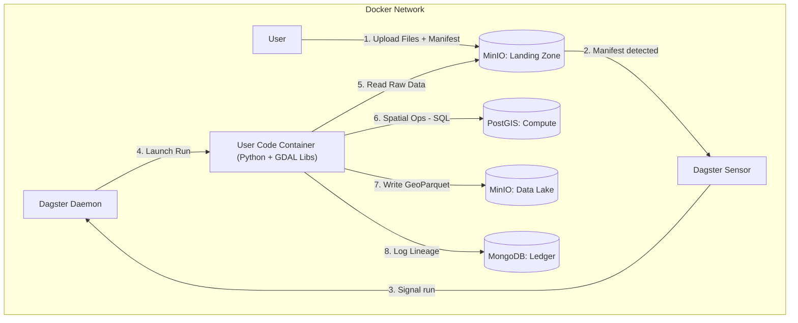

# data-etl-dagster — Agent Guide

## What this repo is / owns

This repo implements an offline-first Spatial Data ETL platform orchestrated by Dagster.
It ingests raw spatial files via a manifest protocol, uses PostGIS for transient compute, stores outputs in MinIO (data lake), and records lineage/metadata in MongoDB (ledger).

## Key invariants / non-negotiables

- **Offline-first**: no public cloud dependencies at runtime.
- **Ledger**: MongoDB is the Source of Truth. No Mongo record = data doesn’t exist.
- **Persistence**: PostGIS is transient compute only. Never store permanent data there.
- **Isolation**: GDAL/heavy spatial libs live only in the `user-code` container.
- **Ingestion contract**: write to `landing-zone` → process → write to `data-lake`. No direct writes to the lake.

## Entry points / key files

- **Docker orchestration**: `docker-compose.yaml`
- **Dagster user code**: `services/dagster/etl_pipelines/`
- **Dagster definitions**: `services/dagster/etl_pipelines/definitions.py` (register assets/jobs/sensors here)
- **Shared libraries**: `libs/`
- **Tests**: `tests/`

## Architecture (high level)



## Ingestion contract (manifest protocol)

### Buckets

- `s3://landing-zone/`: raw uploads + manifests (ephemeral)
- `s3://data-lake/`: processed outputs (permanent)

### Upload sequence

1. Upload raw files to a batch prefix (example: `s3://landing-zone/batch_XYZ/...`).
2. Upload a manifest JSON to `s3://landing-zone/manifests/<batch_id>.json`.

### Manifest schema (current)

```json
{
  "batch_id": "unique_batch_identifier",
  "uploader": "user_or_system_id",
  "intent": "ingest_vector",
  "files": [
    {
      "path": "s3://landing-zone/batch_XYZ/input.geojson",
      "type": "vector",
      "format": "GeoJSON",
      "crs": "EPSG:4326"
    }
  ],
  "metadata": {
    "project": "ALPHA",
    "description": "User supplied context"
  }
}
```

- The `intent` selects a transformation recipe. Unknown intents fall back to the default.
- Vector geometry column is standardized to `geom` in PostGIS compute schemas.

## How to work here

- **Where to change orchestration**: `services/dagster/etl_pipelines/`
- **Where to change shared logic**: `libs/` (requires rebuilding the `user-code` image in Docker for runtime)
- **Dependency pins**:
  - Dagster pins live in `services/dagster/requirements.txt` and `services/dagster/requirements-user-code.txt`.
  - Keep Dagster core packages on the same patch version; keep integration track versions aligned.

## Common tasks

- **Add a new Dagster asset/op/sensor**: implement under `services/dagster/etl_pipelines/`, then register in `services/dagster/etl_pipelines/definitions.py`.
- **Add / modify a Pydantic model**: update `libs/models/` and its tests.
- **Add a new transformation step or recipe**: update `libs/transformations/` and its tests.

## Testing / verification

- **Unit tests**: `pytest tests/unit`
- **Integration tests** (requires Docker stack): `pytest -m integration tests/integration`

## Links

- `services/dagster/AGENTS.md`
- `services/minio/AGENTS.md`
- `services/mongodb/AGENTS.md`
- `services/postgis/AGENTS.md`
- `libs/models/AGENTS.md`
- `libs/spatial_utils/AGENTS.md`
- `libs/transformations/AGENTS.md`
- `tests/AGENTS.md`
