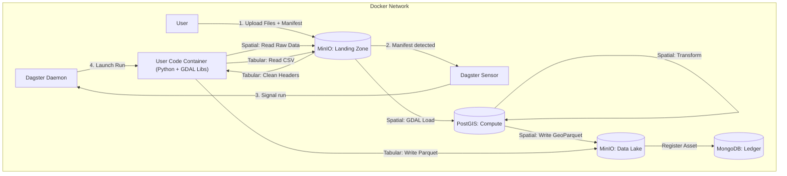

# data-etl-dagster — Agent Guide

## What this repo is / owns

This repo implements an offline-first Spatial and Tabular Data ETL platform orchestrated by Dagster.
It ingests raw spatial files (vector/raster) and tabular files (CSV) via a manifest protocol, uses PostGIS for transient spatial compute, stores outputs in MinIO (data lake), and records lineage/metadata in MongoDB (ledger).

## Key invariants / non-negotiables

- **Offline-first**: no public cloud dependencies at runtime.
- **Ledger**: MongoDB is the Source of Truth. No Mongo record = data doesn’t exist.
- **Persistence**: PostGIS is transient compute only. Never store permanent data there.
- **Isolation**: GDAL/heavy spatial libs live only in the `user-code` container.
- **Ingestion contract**: write to `landing-zone` → process → write to `data-lake`. No direct writes to the lake.

## Entry points / key files

- **Docker orchestration**: `docker-compose.yaml`
- **Dagster user code**: `services/dagster/etl_pipelines/`
- **Dagster definitions**: `services/dagster/etl_pipelines/definitions.py` (register assets/jobs/sensors here)
- **Shared libraries**: `libs/`
- **Tests**: `tests/`

## Architecture (high level)



## Ingestion contract (manifest protocol)

### Buckets

- `s3://landing-zone/`: raw uploads + manifests (ephemeral)
- `s3://data-lake/`: processed outputs (permanent)

### Upload sequence

1. Upload raw files to a batch prefix (example: `s3://landing-zone/batch_XYZ/...`).
2. Upload a manifest JSON to `s3://landing-zone/manifests/<batch_id>.json`.

### Manifest schema (Phase 3: Spatial + Tabular)

The platform supports both spatial and tabular data ingestion via manifest-driven processing.

#### Spatial Ingestion (Vector/Raster)

```json
{
  "batch_id": "unique_batch_identifier",
  "uploader": "user_or_system_id",
  "intent": "ingest_vector",
  "files": [
    {
      "path": "s3://landing-zone/batch_XYZ/input.geojson",
      "type": "vector",
      "format": "GeoJSON"
    }
  ],
  "metadata": {
    "project": "ALPHA",
    "description": "User supplied context",
    "tags": {
      "priority": 1,
      "source": "user",
      "published": false
    },
    "join_config": {
      "target_asset_id": "dataset_ab12cd34ef56",
      "left_key": "parcel_id",
      "right_key": "parcel_id",
      "how": "left"
    }
  }
}
```

#### Tabular Ingestion (CSV)

```json
{
  "batch_id": "unique_batch_identifier",
  "uploader": "user_or_system_id",
  "intent": "ingest_tabular",
  "files": [
    {
      "path": "s3://landing-zone/batch_XYZ/data.csv",
      "type": "tabular",
      "format": "CSV"
    }
  ],
  "metadata": {
    "project": "ALPHA",
    "description": "Tabular dataset for analysis",
    "tags": {
      "priority": 1,
      "source": "user",
      "dataset_id": "custom_dataset_001",
      "join_key": "parcel_id"
    }
  }
}
```

### Key Differences: Spatial vs Tabular Ingestion

| Aspect | Spatial | Tabular |
|--------|---------|---------|
| **File Types** | `vector`, `raster` | `tabular` only |
| **Intents** | Various (e.g., `ingest_vector`, `ingest_building_footprints`) | `ingest_tabular` only |
| **Processing** | PostGIS compute → GeoParquet | Direct CSV → Parquet |
| **Output Format** | GeoParquet (with CRS/bounds) | Parquet (no spatial metadata) |
| **Files per Manifest** | Multiple allowed | Exactly 1 required |
| **Join Keys** | Optional | Optional, but recommended for join-capable datasets |
| **CRS/Bounds** | Required in output | None in output |

- **Spatial**: Uses PostGIS for geometry processing, applies transformation recipes, outputs GeoParquet with spatial metadata
- **Tabular**: Direct CSV processing with header cleaning, outputs standard Parquet, no PostGIS involvement
- **Intent enforcement**: `intent == "ingest_tabular"` requires all files to be `tabular`; other intents forbid `tabular` files
- **Dataset ID**: For tabular, can be auto-generated or specified via `metadata.tags.dataset_id`
- `metadata.tags` accepts primitive scalars only (str/int/float/bool); all other metadata keys are rejected.

## How to work here

- **Where to change orchestration**: `services/dagster/etl_pipelines/`
- **Where to change shared logic**: `libs/` (requires rebuilding the `user-code` image in Docker for runtime)
- **Dependency pins**:
  - Dagster pins live in `services/dagster/requirements.txt` and `services/dagster/requirements-user-code.txt`.
  - Keep Dagster core packages on the same patch version; keep integration track versions aligned.

### Pinned Dagster versions

Current pinned versions (as of Phase 5):

- **Core packages** (same patch version):
  - `dagster==1.12.5`
  - `dagster-webserver==1.12.5`

- **Integration packages** (aligned track versions):
  - `dagster-postgres==0.28.5`
  - `dagster-aws==0.28.5`

See `services/dagster/requirements.txt` and `services/dagster/requirements-user-code.txt` for the complete dependency lists.

## Common tasks

- **Add a new Dagster asset/op/sensor**: implement under `services/dagster/etl_pipelines/`, then register in `services/dagster/etl_pipelines/definitions.py`.
- **Add / modify a Pydantic model**: update `libs/models/` and its tests.
- **Add a new transformation step or recipe**: update `libs/transformations/` and its tests.

## Testing / verification

- **Unit tests**: `pytest tests/unit`
- **Integration tests** (requires Docker stack): `pytest -m "integration and not e2e" tests/integration`
- **E2E tests** (GraphQL-launched `ingest_job`, requires Docker stack): `pytest -m "integration and e2e" tests/integration`
- **Service readiness**: `python scripts/wait_for_services.py` (checks reachability and user-code loadability)
- **Container stability**: `python scripts/check_container_stability.py` (monitors restart counts, used in CI)

## Links

- `services/dagster/AGENTS.md`
- `services/minio/AGENTS.md`
- `services/mongodb/AGENTS.md`
- `services/postgis/AGENTS.md`
- `libs/models/AGENTS.md`
- `libs/spatial_utils/AGENTS.md`
- `libs/transformations/AGENTS.md`
- `tests/AGENTS.md`
