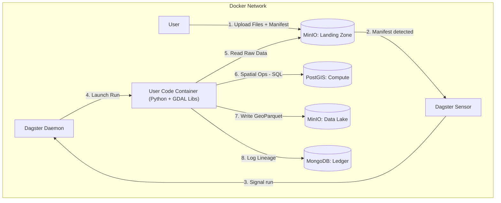

# Project Context: Spatial Data ETL Pipeline (Dagster/Docker)

## 1. Project Overview

**Goal:** Build an automated, containerized ETL pipeline specialized for processing spatial data (vector and raster).

### Core Philosophy

- **Offline First:** The system operates 100% on-premise without active public cloud dependencies.
- **Source of Truth:** Strict control over data provenance. MongoDB acts as the ledger; MinIO acts as the vault.
- **Infrastructure Agnostic:** Built using Docker Compose for development, targeting Kubernetes (Kustomize) for production.

## 2. Technology Stack

- **Orchestrator:** Dagster (Python 3.10+).
- **Object Storage:** MinIO (S3-compatible API).
- **Metadata Storage:** MongoDB (Structured, Queryable).
- **Spatial Compute:**
  - **PostGIS:** Used purely as a transient compute engine (Load → Transform → Dump → Drop).
  - **GDAL:** Used via CLI (wrapped in Python) for raster/vector file operations.
- **Data Formats:**
  - **Data at Rest:** GeoParquet (primary), Cloud Optimized GeoTIFF (raster).
  - **Metadata:** JSON (following ISO19139 / ISO19115 patterns).

## 3. Infrastructure Architecture

The system runs as a closed loop within a Docker network. Storage is logically separated into "Landing" (Input) and "Lake" (Permanent).



## 4. The Ingestion Contract (Protocol)

To manage the "Staging" requirement and prevent race conditions, the system enforces a strict Manifest Pattern.

### 1. Logical Bucket Separations

- `s3://landing-zone/`: Read/Write for Users. Ephemeral storage for raw uploads.
- `s3://data-lake/`: Read-Only for Users. Permanent storage for processed, versioned data.

### 2. User Upload Sequence

Users or upstream systems must follow this order:

1. **Upload Assets:** Upload raw files (TIFF, SHP, etc.) to a sub-folder in the landing zone (e.g., `s3://landing-zone/batch_XYZ/`).
2. **Commit (Trigger):** Upload a manifest.json to `s3://landing-zone/manifests/batch_XYZ.json`.

### 3. The Manifest Schema

The Dagster Sensor listens only for JSON files. The JSON must adhere to this structure:

```json
{
  "batch_id": "unique_batch_identifier",
  "uploader": "user_or_system_id",
  "intent": "ingest_satellite_raster", 
  "files": [
    {
      "path": "s3://landing-zone/batch_XYZ/raw_image.tif",
      "type": "raster",
      "format": "GTiff",
      "crs": "EPSG:4326"
    }
  ],
  "metadata": {
    "project": "ALPHA",
    "description": "User supplied context"
  }
}
```

## 5. Key Implementation Requirements

### A. Data Management & Traceability

#### The Mongo Ledger:

- MongoDB is the absolute registry. If it's not in Mongo, it doesn't strictly "exist" in the platform.
- **Linking:** Mongo documents store the `s3_key`. S3 Objects store the `mongodb_doc_id` in their user-metadata headers.
- **Versioning:** Every asset must track its `run_id` (Dagster) and `content_hash` (SHA256).
- **Validation:**
  - **DB Level:** MongoDB JSON Schema Validation enabled on collections.
  - **App Level:** Python Pydantic models used for all internal data passing.

### B. The "Compute Engine" Pattern (PostGIS)

PostGIS is not for persistence. The pipeline must:

1. **Spin Up:** Create a temporary schema (e.g., `proc_{run_id}`).
2. **Ingest:** ogr2ogr or COPY data from S3 to PostGIS.
3. **Process:** Execute spatial SQL.
4. **Eject:** Export results to S3 (GeoParquet).
5. **Teardown:** Drop the temporary schema.

### C. Dagster Specifics

#### Configurable Resources:

- **GDALResource:** Wraps `subprocess.Popen`. Must be mockable for unit tests.
- **PostGISResource:** Manages connection pools and ephemeral schema lifecycle.
- **MinIOResource:** Wrapper around boto3 (or `dagster-aws` S3 resources) pointed at the MinIO endpoint.

#### Environment:

All secrets/hosts defined via `.env` file and loaded into Dagster configuration.

## 6. Testing Strategy

The project uses a multi-layered testing approach:

### Test Types

1. **Unit Tests** (`tests/unit/`): Test Pydantic models, validation logic, and business logic in isolation. These tests do not require running services and use mocks where needed.

2. **Integration Tests** (`tests/integration/`): Test connectivity and basic operations against running services (MinIO, MongoDB, PostGIS, Dagster). These tests verify that:
   - Services are accessible and responding
   - Configuration models correctly connect to services
   - Basic CRUD operations work (read/write to MinIO, MongoDB, PostGIS)
   - Dagster GraphQL API is accessible

3. **End-to-End Tests** (Future): Test complete pipeline workflows that exercise all services together.

### Test Dependencies

Integration tests require additional dependencies (see `requirements-test.txt`):
- `requests`: HTTP client for Dagster GraphQL API
- `minio`: MinIO Python client for S3 operations
- `pymongo`: MongoDB Python client
- `psycopg2-binary`: PostgreSQL/PostGIS client
- `tenacity`: Retry library for service health checks

### Running Tests

- **Unit tests only**: `pytest tests/unit`
- **Integration tests**: Requires Docker stack running. Use `pytest -m integration tests/integration`
- **All tests**: `pytest` (runs both unit and integration)

### CI/CD Integration

Integration tests run in GitHub Actions using Docker Compose to spin up the full service stack. See `.github/workflows/integration.yml` for the CI configuration.

## 7. Development Workflow (Dagster user code)

- Edit pipeline code under `services/dagster/etl_pipelines` — hot-reloads in dev mode.
- Edit shared library code under `libs/` — requires rebuilding user-code: `docker-compose build user-code`
- **Note:** `libs/` is installed as a package, not mounted for runtime. This ensures consistent import resolution.
- Development: `docker-compose up` uses a bind mount for `etl_pipelines`; code reloads without rebuilding the user-code image.
- Production: rebuild the user-code image (COPY in `Dockerfile.user-code` includes code).
- Keep Dagster packages pinned to the same patch level across `requirements.txt` and `requirements-user-code.txt`.

## 8. Common Mistakes / Gotchas

- Dagster package drift (e.g., `dagster-postgres` not matching `dagster` patch) leads to runtime/import errors—pin all Dagster packages to the same patch.
- Overly broad dependency ranges (`>=` without upper bounds) can break reproducibility—prefer pinning and review quarterly.
- Forgetting to register new assets/jobs/resources/sensors in `services/dagster/etl_pipelines/definitions.py` (`defs`) means Dagster will not load them.
- For production, changing code without rebuilding the user-code image leaves stale code running—always rebuild before deploy.
- Version tracks differ: core Dagster uses 1.x; integrations (e.g., `dagster-postgres`, `dagster-aws`) use 0.28.x. Pin explicitly to matching tracks to avoid resolver/runtime issues.
- Current pins (Dec 2025): `dagster==1.12.5`, `dagster-webserver==1.12.5`, `dagster-postgres==0.28.4`, `dagster-aws==0.28.4`.
## 9. Repository Structure

This is a Git monorepo with the following layout:

```
data-etl-dagster/
├── CONTEXT.md              # This file (Global Context)
├── .gitignore
├── .env.example
├── docker-compose.yaml     # Development orchestration
├── requirements.txt        # Base library dependencies
├── requirements-test.txt   # Test dependencies (includes base)
├── services/               # Containerized services
│   ├── dagster/           # Dagster orchestrator (webserver, daemon, user code)
│   ├── minio/             # MinIO object storage configuration
│   ├── mongodb/           # MongoDB metadata store configuration
│   └── postgis/           # PostGIS compute engine configuration
├── libs/                   # Shared Python libraries (installable package)
│   ├── pyproject.toml     # Package definition
│   ├── __init__.py        # Package root
│   ├── spatial_utils/     # GDAL wrappers, spatial operations
│   └── models/            # Pydantic models, schemas
├── tests/                  # Test suite
│   ├── unit/              # Unit tests (no services required)
│   └── integration/       # Integration tests (requires Docker stack)
├── scripts/                # Utility scripts
│   └── wait_for_services.py  # Service health check helper
└── configs/               # Configuration templates
```

## 10. Recipe-Based Transformation Architecture

The pipeline uses a **recipe-based transformation architecture** that enables flexible, intent-driven spatial transformations. This architecture organizes SQL operations into reusable step classes that are composed into recipes based on the manifest `intent` field.

### Architecture Overview

The recipe-based system consists of three main components:

1. **Transformation Steps**: Individual transformation operations (e.g., CRS normalization, geometry simplification, spatial indexing) implemented as step classes
2. **Recipe Registry**: Maps manifest `intent` values to ordered lists of transformation steps
3. **Table Chaining**: Executes steps sequentially, creating intermediate tables for debugging and step isolation

### How It Works

1. **Recipe Selection**: The `RecipeRegistry.get_vector_recipe()` method reads the manifest `intent` field and returns a list of transformation steps
2. **Step Execution**: Steps are executed in order with table chaining:
   - `raw_data` → `step_0` → `step_1` → ... → `processed`
3. **SQL Generation**: Each step generates PostGIS SQL that is executed within the ephemeral schema context
4. **Step Types**:
   - **Transform Steps**: Create new tables via `CREATE TABLE ... AS SELECT` (e.g., `NormalizeCRSStep`, `SimplifyGeometryStep`)
   - **Index Steps**: Operate on existing tables without creating new ones (e.g., `CreateSpatialIndexStep`)

### Default Recipe

The default vector transformation recipe includes:
1. **NormalizeCRSStep**: Transforms geometries to EPSG:4326 (configurable)
2. **SimplifyGeometryStep**: Simplifies geometries while preserving topology
3. **CreateSpatialIndexStep**: Creates GIST spatial index on the geometry column

### Intent-Based Customization

Recipes can be customized per manifest intent. For example:
- `ingest_vector`: Default recipe (CRS normalization, simplification, indexing)
- `ingest_road_network`: Can use a customized recipe with different parameters

Unknown intents fall back to the default recipe for backward compatibility.

### Geometry Column Contract

All vector transformation steps enforce a **single-geometry-column** contract:
- Input assumption: Input table has exactly one geometry column (default: `"geom"`)
- Output guarantee: Output table has exactly one geometry column with the same name
- Runtime validation: Steps validate the contract using `information_schema.columns` before execution

This ensures predictable geometry column naming throughout the pipeline and prevents geometry column proliferation.

### Integration Points

- **Used by**: `services/dagster/etl_pipelines/ops/transform_op.py`
- **Library**: `libs/transformations/` (see `libs/transformations/CONTEXT.md` for detailed documentation)
- **Execution**: SQL is executed via `PostGISResource.execute_sql()` within ephemeral schemas

## 11. Geometry Column Contract

In PostGIS compute schemas, vector geometry column is standardized to `geom` (configurable), and transforms preserve a single geometry column. Bounds may be empty for empty datasets.

Each service and library directory contains its own `CONTEXT.md` that describes:
- The component's specific responsibilities
- Input/output contracts
- Relation to the global architecture
- Configuration requirements

