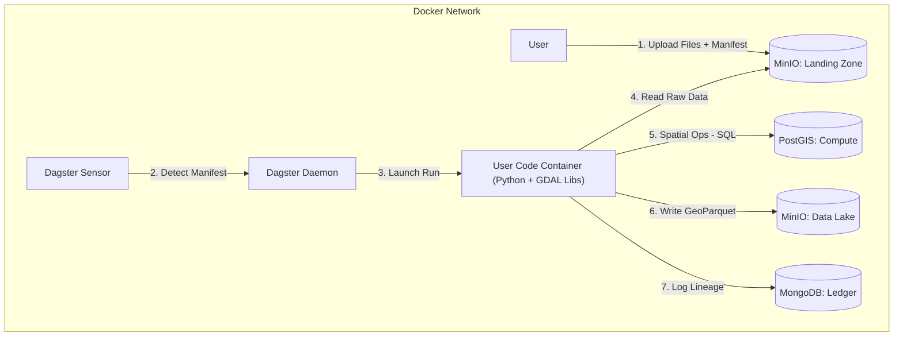

# Project Context: Spatial Data ETL Pipeline (Dagster/Docker)

## 1. Project Overview

**Goal:** Build an automated, containerized ETL pipeline specialized for processing spatial data (vector and raster).

### Core Philosophy

- **Offline First:** The system operates 100% on-premise without active public cloud dependencies.
- **Source of Truth:** Strict control over data provenance. MongoDB acts as the ledger; MinIO acts as the vault.
- **Infrastructure Agnostic:** Built using Docker Compose for development, targeting Kubernetes (Kustomize) for production.

## 2. Technology Stack

- **Orchestrator:** Dagster (Python 3.10+).
- **Object Storage:** MinIO (S3-compatible API).
- **Metadata Storage:** MongoDB (Structured, Queryable).
- **Spatial Compute:**
  - **PostGIS:** Used purely as a transient compute engine (Load → Transform → Dump → Drop).
  - **GDAL:** Used via CLI (wrapped in Python) for raster/vector file operations.
- **Data Formats:**
  - **Data at Rest:** GeoParquet (primary), Cloud Optimized GeoTIFF (raster).
  - **Metadata:** JSON (following ISO19139 / ISO19115 patterns).

## 3. Infrastructure Architecture

The system runs as a closed loop within a Docker network. Storage is logically separated into "Landing" (Input) and "Lake" (Permanent).



## 4. The Ingestion Contract (Protocol)

To manage the "Staging" requirement and prevent race conditions, the system enforces a strict Manifest Pattern.

### 1. Logical Bucket Separations

- `s3://landing-zone/`: Read/Write for Users. Ephemeral storage for raw uploads.
- `s3://data-lake/`: Read-Only for Users. Permanent storage for processed, versioned data.

### 2. User Upload Sequence

Users or upstream systems must follow this order:

1. **Upload Assets:** Upload raw files (TIFF, SHP, etc.) to a sub-folder in the landing zone (e.g., `s3://landing-zone/batch_XYZ/`).
2. **Commit (Trigger):** Upload a manifest.json to `s3://landing-zone/manifests/batch_XYZ.json`.

### 3. The Manifest Schema

The Dagster Sensor listens only for JSON files. The JSON must adhere to this structure:

```json
{
  "batch_id": "unique_batch_identifier",
  "uploader": "user_or_system_id",
  "intent": "ingest_satellite_raster", 
  "files": [
    {
      "path": "s3://landing-zone/batch_XYZ/raw_image.tif",
      "type": "raster",
      "format": "GTiff",
      "crs": "EPSG:4326"
    }
  ],
  "metadata": {
    "project": "ALPHA",
    "description": "User supplied context"
  }
}
```

## 5. Key Implementation Requirements

### A. Data Management & Traceability

#### The Mongo Ledger:

- MongoDB is the absolute registry. If it's not in Mongo, it doesn't strictly "exist" in the platform.
- **Linking:** Mongo documents store the `s3_key`. S3 Objects store the `mongodb_doc_id` in their user-metadata headers.
- **Versioning:** Every asset must track its `run_id` (Dagster) and `content_hash` (SHA256).
- **Validation:**
  - **DB Level:** MongoDB JSON Schema Validation enabled on collections.
  - **App Level:** Python Pydantic models used for all internal data passing.

### B. The "Compute Engine" Pattern (PostGIS)

PostGIS is not for persistence. The pipeline must:

1. **Spin Up:** Create a temporary schema (e.g., `proc_{run_id}`).
2. **Ingest:** ogr2ogr or COPY data from S3 to PostGIS.
3. **Process:** Execute spatial SQL.
4. **Eject:** Export results to S3 (GeoParquet).
5. **Teardown:** Drop the temporary schema.

### C. Dagster Specifics

#### Configurable Resources:

- **GDALResource:** Wraps `subprocess.Popen`. Must be mockable for unit tests.
- **PostGISResource:** Manages connection pools and ephemeral schema lifecycle.
- **MinIOResource:** Wrapper around boto3.

#### Environment:

All secrets/hosts defined via `.env` file and loaded into Dagster configuration.

## 6. Coding Directives for AI Generation

- **Language:** Python 3.10+.
- **Typing:** Strict type hinting (typing module) and Pydantic models.
- **Error Handling:** Fail fast. Implement try/finally blocks to ensure ephemeral PostGIS schemas are dropped even if the pipeline fails.
- **Testing:** Use pytest. The architecture must allow GDALResource and S3Resource to be mocked so logic can be tested without a running Docker stack.

## 7. Repository Structure

This is a Git monorepo with the following layout:

```
data-etl-dagster/
├── CONTEXT.md              # This file (Global Context)
├── .gitignore
├── .env.example
├── docker-compose.yaml     # Development orchestration
├── services/               # Containerized services
│   ├── dagster/           # Dagster orchestrator (webserver, daemon, user code)
│   ├── minio/             # MinIO object storage configuration
│   ├── mongodb/           # MongoDB metadata store configuration
│   └── postgis/           # PostGIS compute engine configuration
├── libs/                   # Shared Python libraries
│   ├── spatial_utils/     # GDAL wrappers, spatial operations
│   └── models/            # Pydantic models, schemas
└── configs/               # Configuration templates
```

Each service and library directory contains its own `CONTEXT.md` that describes:
- The component's specific responsibilities
- Input/output contracts
- Relation to the global architecture
- Configuration requirements

