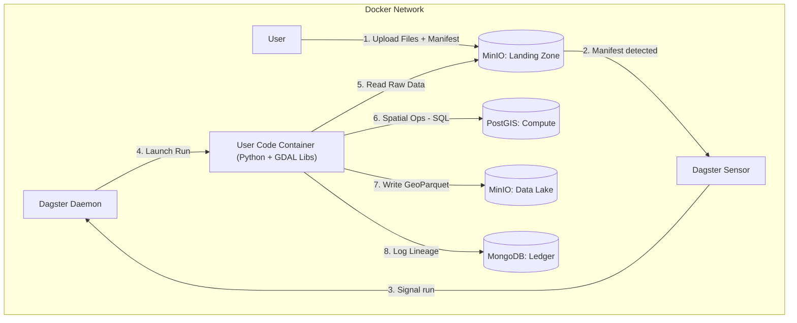

# Spatial Data ETL Pipeline

An automated, containerized ETL pipeline specialized for processing spatial data (vector and raster) using Dagster, PostGIS, MinIO, and MongoDB.

## Overview

This platform processes spatial data through a strict manifest-based ingestion protocol:

1. **Upload** raw files to MinIO landing zone
2. **Trigger** processing via manifest JSON
3. **Transform** data using PostGIS as a compute engine with recipe-based transformations (geometry column standardized to `geom`)
4. **Store** processed GeoParquet in the data lake
5. **Track** lineage in MongoDB ledger

**Recipe-Based Transformations:** The pipeline uses a recipe-based transformation architecture that maps manifest `intent` fields to ordered lists of transformation steps (CRS normalization, geometry simplification, spatial indexing). See `CONTEXT.md` Section 10 for details.

**Geometry Column Contract:** In PostGIS compute schemas, vector geometry column is standardized to `geom`, and transforms preserve a single geometry column. Bounds may be empty for empty datasets.

## Quick Start

### Prerequisites

- Docker & Docker Compose v2+
- Git

### Setup

```bash
# Clone the repository
git clone <repository-url>
cd data-etl-dagster

# Copy environment template
copy env.example .env

# Start all services
docker compose up -d

# Access the Dagster UI
# Open http://localhost:3000
```

### Service Endpoints

| Service | URL | Credentials |
|---------|-----|-------------|
| Dagster UI | http://localhost:3000 | - |
| MinIO Console | http://localhost:9001 | See .env |
| MinIO API | http://localhost:9000 | See .env |
| MongoDB | localhost:27017 | See .env |
| PostGIS | localhost:5432 | See .env |

## Usage

### Triggering Data Ingestion

The pipeline uses a manifest-based ingestion protocol. To trigger processing, upload a `manifest.json` file to the MinIO landing zone.

#### Step 1: Upload Your Data Files

First, upload your raw spatial data files (GeoTIFF, Shapefile, GeoJSON, etc.) to the landing zone bucket:

```bash
# Using MinIO client (mc)
mc cp your-data.tif minio/landing-zone/batch_001/your-data.tif

# Or using AWS CLI (configured for MinIO)
aws --endpoint-url http://localhost:9000 s3 cp your-data.tif s3://landing-zone/batch_001/your-data.tif
```

**Note:** Organize files in subdirectories (e.g., `batch_001/`) to keep batches separate.

#### Step 2: Create and Upload Manifest

Create a `manifest.json` file describing your data. The manifest format is currently being standardized, but the following structure is supported:

```json
{
  "batch_id": "unique_batch_identifier",
  "uploader": "user_or_system_id",
  "intent": "ingest_satellite_raster",
  "files": [
    {
      "path": "s3://landing-zone/batch_001/your-data.tif",
      "type": "raster",
      "format": "GTiff",
      "crs": "EPSG:4326"
    }
  ],
  "metadata": {
    "project": "ALPHA",
    "description": "User supplied context"
  }
}
```

**Manifest Fields:**
- `batch_id` (required): Unique identifier for this batch
- `uploader` (required): User or system identifier
- `intent` (required): Processing intent (e.g., `ingest_satellite_raster`, `ingest_vector`)
- `files` (required): Array of file entries, each with:
  - `path`: S3 path to the file (must start with `s3://landing-zone/`)
  - `type`: File type (`raster` or `vector`)
  - `format`: Input format (e.g., `GTiff`, `GPKG`, `SHP`, `GeoJSON`)
  - `crs`: Coordinate Reference System (e.g., `EPSG:4326`)
- `metadata` (required): User-supplied metadata with:
  - `project`: Project identifier
  - `description`: Optional description

**Note:** The manifest schema is subject to change as the system evolves. Check `CONTEXT.md` for the latest schema definition.

Upload the manifest to the `manifests/` prefix:

```bash
# Using MinIO client
mc cp manifest.json minio/landing-zone/manifests/batch_001.json

# Or using AWS CLI
aws --endpoint-url http://localhost:9000 s3 cp manifest.json s3://landing-zone/manifests/batch_001.json
```

#### Step 3: Monitor Processing

The manifest sensor polls the `manifests/` prefix every 30 seconds. Once your manifest is detected:

1. **Sensor Detection** (within 30 seconds):
   - The manifest sensor detects the new JSON file
   - Validates the manifest against the schema
   - If valid, triggers the ingestion job

2. **Job Execution**:
   - The ingestion job processes your files
   - Data is transformed using PostGIS
   - Processed files are written to the data lake
   - Metadata is recorded in MongoDB

3. **Monitor Progress**:
   - View job status in Dagster UI: http://localhost:3000
   - Check logs for processing details
   - Verify results in the data lake bucket

### What Happens After Upload

Once a manifest is uploaded, the following sequence occurs:

1. **Sensor Polling**: The manifest sensor checks for new manifests every 30 seconds
2. **Validation**: The manifest is validated against the Pydantic schema
3. **Job Trigger**: If valid, a Dagster run is created with the manifest data
4. **Processing**: The ingestion job executes (currently a placeholder that logs the manifest)
5. **Tracking**: The manifest is marked as processed in the sensor cursor (prevents duplicate runs)

**Important Notes:**
- Each manifest is processed **only once** (even if invalid)
- Invalid manifests are logged but not retried automatically
- Processing status can be viewed in the Dagster UI

### Retrying Failed Ingestion

If ingestion fails or you need to reprocess a manifest, you have several options:

#### Option 1: Re-upload with New Key (Recommended for Phase 3)

The simplest approach is to upload the manifest with a different filename:

```bash
# Original manifest
s3://landing-zone/manifests/batch_001.json

# Retry with new key
s3://landing-zone/manifests/batch_001_retry.json
```

**Why this works:** The sensor tracks processed manifests by their S3 key. A new key is treated as a new manifest.

**When to use:** 
- Quick retry after fixing manifest errors
- Reprocessing with corrected data
- Testing different processing parameters

#### Option 2: Manual Job Trigger (Always Available)

You can manually trigger the ingestion job via the Dagster UI:

1. Navigate to http://localhost:3000
2. Go to the "Jobs" section
3. Select `ingest_job`
4. Click "Launch Run"
5. Provide the manifest data in the run config:

```yaml
ops:
  ingest_placeholder:
    config:
      manifest:
        batch_id: "batch_001"
        uploader: "user_123"
        intent: "ingest_satellite_raster"
        files:
          - path: "s3://landing-zone/batch_001/your-data.tif"
            type: "raster"
            format: "GTiff"
            crs: "EPSG:4326"
        metadata:
          project: "ALPHA"
          description: "Retry after fix"
      manifest_key: "manifests/batch_001_retry.json"
```

**When to use:**
- Full control over run configuration
- Testing specific scenarios
- Bypassing sensor entirely

#### Option 3: Future Retry Mechanisms (Phase 4+)

Future enhancements will provide automated retry mechanisms:

- **Retry Prefix/Folder**: Move manifest to `manifests/retry/` to bypass cursor check
- **MongoDB Status Check**: Update manifest status in MongoDB to allow retry
- **Automatic Retry**: Failed runs automatically retry based on status

These options will be documented when implemented.

### Troubleshooting

**Manifest not detected:**
- Verify the file is in `s3://landing-zone/manifests/` prefix
- Ensure the file has a `.json` extension
- Check sensor status in Dagster UI (should be RUNNING)
- Wait up to 30 seconds for sensor polling interval

**Manifest validation errors:**
- Check Dagster logs for validation error details
- Verify all required fields are present
- Ensure S3 paths are correct and files exist
- Check CRS format (must be valid EPSG code, WKT, or PROJ string)

**Job not executing:**
- Check Dagster UI for run status
- Verify resources (MinIO, MongoDB, PostGIS) are accessible
- Review job logs for errors
- Ensure the manifest was successfully validated

## Architecture



## Repository Structure

```
data-etl-dagster/
├── CONTEXT.md              # Global architecture context
├── docker-compose.yaml     # Service orchestration
├── services/
│   ├── dagster/           # Dagster orchestrator
│   ├── minio/             # Object storage config
│   ├── mongodb/           # Metadata store config
│   └── postgis/           # Compute engine config
├── libs/                   # Shared Python libraries (installable package)
│   ├── pyproject.toml     # Package definition
│   ├── __init__.py        # Package root
│   ├── spatial_utils/     # GDAL wrappers
│   ├── transformations/   # Recipe-based transformation steps
│   └── models/            # Pydantic schemas
└── configs/               # Configuration templates
```

## Documentation

Each component has its own `CONTEXT.md` with detailed documentation:

- [Global Context](./CONTEXT.md) - Architecture and philosophy
- [Dagster](./services/dagster/CONTEXT.md) - Orchestration layer
- [MinIO](./services/minio/CONTEXT.md) - Object storage
- [MongoDB](./services/mongodb/CONTEXT.md) - Metadata ledger
- [PostGIS](./services/postgis/CONTEXT.md) - Compute engine
- [Spatial Utils](./libs/spatial_utils/CONTEXT.md) - GDAL wrappers
- [Transformations](./libs/transformations/CONTEXT.md) - Recipe-based transformation architecture
- [Models](./libs/models/CONTEXT.md) - Data schemas

## Development

### Local Development

```bash
# Start services in development mode
docker compose up -d

# View logs
docker compose logs -f dagster-webserver

# Rebuild after code changes
docker compose up -d --build user-code
```

### Testing

The project includes both unit tests (no services required) and integration tests (requires Docker stack).

#### Prerequisites

```bash
# Install test dependencies
pip install -r requirements-test.txt
```

#### Unit Tests

Unit tests validate Pydantic models and business logic without requiring running services:

```bash
# Run unit tests only
pytest tests/unit -v
```

#### Integration Tests

Integration tests verify connectivity and basic operations against running services. These require the Docker stack to be running.

**1. Start the Docker stack:**

```bash
# Start all services required for integration tests
docker compose -f docker-compose.yaml up -d --build \
  dagster-webserver dagster-daemon user-code minio minio-init mongodb postgis dagster-postgres
```

**2. Wait for services to be ready:**

```bash
# Wait for all services to become healthy
python scripts/wait_for_services.py
```

This script polls each service (MinIO, MongoDB, PostGIS, Dagster) until they're ready or timeout is reached.

**3. Run integration tests:**

```bash
# Run integration tests
pytest -m integration tests/integration -v
```

**4. Stop the Docker stack:**

```bash
# Stop and remove containers and volumes
docker compose -f docker-compose.yaml down -v
```

#### Running All Tests

```bash
# Run unit tests first
pytest tests/unit -v

# Then run integration tests (if Docker stack is running)
pytest -m integration tests/integration -v
```

#### Test Coverage

**Unit Tests** (`tests/unit/`) - No external dependencies required:
- `test_models.py` - Pydantic schemas validation (55 tests)
  - CRS validation (EPSG, WKT, PROJ formats)
  - Bounds validation
  - Manifest validation and status tracking
  - Asset registry models
  - Content hash validation
  - Configuration settings loading
  - S3 path/key validation
- `test_minio_resource.py` - MinIO resource operations (16 tests)
  - Manifest listing and filtering
  - Manifest download and JSON parsing
  - Archive operations (copy and delete)
  - File upload to data lake with content-type inference
  - Presigned URL generation for GDAL

**Integration Tests** (`tests/integration/`) - Requires Docker stack:
- `test_minio.py` - MinIO connectivity and read/write operations
- `test_mongodb.py` - MongoDB connectivity and CRUD operations
- `test_postgis.py` - PostGIS connectivity and spatial functions
- `test_dagster.py` - Dagster GraphQL API connectivity

**Total Coverage:** 55 unit tests + 4 integration tests = 59 tests

#### Continuous Integration

The project uses GitHub Actions with **smart path-based test execution**:

```
Trigger: Pull request or push to main/develop
         ↓
Detect changed files
         ↓
         ├─ Code changes? → Run unit + integration tests
         ├─ Infrastructure/Docker changes? → Run integration tests
         ├─ Docs-only changes? → Skip all tests
         └─ Manual dispatch? → Run all tests (escape hatch)
```

**Workflow file:** `.github/workflows/integration.yml`

**Benefits:**
- ⚡ Fast feedback: Unit tests run in ~5 seconds
- 💰 Resource efficient: Skip expensive Docker for model changes
- 🎯 Targeted: Only run tests relevant to changed files
- 🔄 Safe: Manual dispatch option runs full suite

See the workflow file for detailed path filter configuration.

## License

[Add license information]

