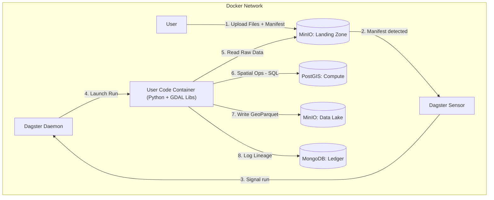

# Spatial Data ETL Pipeline

An automated, containerized ETL pipeline specialized for processing spatial data (vector and raster) using Dagster, PostGIS, MinIO, and MongoDB.

## Overview

This platform processes spatial data through a strict manifest-based ingestion protocol:

1. **Upload** raw files to MinIO landing zone
2. **Trigger** processing via manifest JSON
3. **Transform** data using PostGIS as a compute engine with recipe-based transformations (geometry column standardized to `geom`)
4. **Store** processed GeoParquet in the data lake
5. **Track** lineage in MongoDB ledger

### Sensors (legacy + asset-based)

To fix the “assets defined but never materialized” mismatch, manifests are routed by dedicated sensors:

- `manifest_sensor` (**legacy**) → `ingest_job` (op-based; backwards compatibility; skips tabular/join)
- `spatial_sensor` → `spatial_asset_job` (materializes `raw_spatial_asset` for `ingest_vector` / `ingest_raster`)
- `tabular_sensor` → `tabular_asset_job` (materializes `raw_tabular_asset` for `ingest_tabular`)
- `join_sensor` → `join_asset_job` (materializes `joined_spatial_asset` for `join_datasets`)

### Asset partitioning (dataset_id)

Dagster assets are **partitioned by `dataset_id`** (dynamic partitions) so each dataset can be materialized, reprocessed, and joined independently.

- **Partition key source**: `metadata.tags.dataset_id` if provided; otherwise generated as `dataset_{uuid12}`.
- **Implication**: the same logical assets (spatial/tabular/join) materialize per dataset partition key.

**Recipe-Based Transformations:** The pipeline uses a recipe-based transformation architecture that maps manifest `intent` fields to ordered lists of transformation steps (CRS normalization, geometry simplification, spatial indexing). See `libs/transformations/AGENTS.md` for details.

**Geometry Column Contract:** In PostGIS compute schemas, vector geometry column is standardized to `geom`, and transforms preserve a single geometry column. Bounds may be empty for empty datasets.

## Quick Start

### Prerequisites

- Docker & Docker Compose v2+
- Git

### Setup

```bash
# Clone the repository
git clone <repository-url>
cd data-etl-dagster

# Copy environment template
copy env.example .env

# Start all services
docker compose up -d

# Access the Dagster UI
# Open http://localhost:3000
```

### Service Endpoints

| Service | URL | Credentials |
|---------|-----|-------------|
| Dagster UI | http://localhost:3000 | - |
| Tooling Webapp | http://localhost:8080 | admin:admin |
| MinIO Console | http://localhost:9001 | See .env |
| MinIO API | http://localhost:9000 | See .env |
| MongoDB | localhost:27017 | See .env |
| PostGIS | localhost:5432 | See .env |

## Usage

### Triggering Data Ingestion

The pipeline uses a manifest-based ingestion protocol. To trigger processing, upload a `manifest.json` file to the MinIO landing zone.

#### Step 1: Upload Your Data Files

First, upload your raw spatial data files (GeoTIFF, Shapefile, GeoJSON, etc.) to the landing zone bucket:

```bash
# Using MinIO client (mc)
mc cp your-data.tif minio/landing-zone/batch_001/your-data.tif

# Or using AWS CLI (configured for MinIO)
aws --endpoint-url http://localhost:9000 s3 cp your-data.tif s3://landing-zone/batch_001/your-data.tif
```

**Note:** Organize files in subdirectories (e.g., `batch_001/`) to keep batches separate.

#### Step 2: Create and Upload Manifest

Create a `manifest.json` file describing your data. The manifest format is currently being standardized, but the following structure is supported:

**Example: Vector Data (Building Footprints)**
```json
{
  "batch_id": "batch_buildings_001",
  "uploader": "user_123",
  "intent": "ingest_building_footprints",
  "files": [
    {
      "path": "s3://landing-zone/batch_buildings_001/buildings.geojson",
      "type": "vector",
      "format": "GeoJSON"
    }
  ],
  "metadata": {
    "project": "BUILDINGS_DEMO",
    "description": "Building footprints with intent-driven heavy simplification",
    "tags": {
      "dataset_id": "dataset_ab12cd34ef56",
      "source": "survey",
      "priority": 1
    },
    "join_config": {
      "spatial_asset_id": "507f1f77bcf86cd799439011",
      "tabular_asset_id": "507f1f77bcf86cd799439012",
      "left_key": "parcel_id",
      "right_key": "parcel_id",
      "how": "left"
    }
  }
}
```

**Example: Vector Data (Default Recipe)**
```json
{
  "batch_id": "batch_vector_001",
  "uploader": "user_123",
  "intent": "ingest_vector",
  "files": [
    {
      "path": "s3://landing-zone/batch_vector_001/data.geojson",
      "type": "vector",
      "format": "GeoJSON"
    }
  ],
  "metadata": {
    "project": "ALPHA",
    "description": "User supplied context",
    "tags": {
      "source": "user"
    }
  }
}
```

**Manifest Fields:**
- `batch_id` (required): Unique identifier for this batch
- `uploader` (required): User or system identifier
- `intent` (required): Processing intent that determines the transformation recipe:
  - **Spatial intents:**
    - `ingest_vector`: Default vector recipe (CRS normalization, light simplification, spatial indexing)
    - `ingest_building_footprints`: Building footprints recipe with stronger geometry simplification (0.001° tolerance ≈ 111m at equator) for visibly simplified outlines
    - `ingest_road_network`: Road network recipe (currently uses default recipe, can be customized)
    - Unknown spatial intents fall back to the default recipe
  - **Tabular intent:**
    - `ingest_tabular`: Tabular data ingestion (CSV → Parquet with header cleaning, no PostGIS required)
- `files` (required): Array of file entries, each with:
  - `path`: S3 path to the file (must start with `s3://landing-zone/`)
  - `type`: File type (`raster`, `vector`, or `tabular`)
  - `format`: Input format (e.g., `GTiff`, `GPKG`, `SHP`, `GeoJSON`, `CSV`)
- For spatial files: CRS is inferred from the data during processing; manifests must not include a `crs` field in `files`.
- For tabular files: No CRS is required (tabular data is non-spatial).
- `metadata` (required): User-supplied metadata with explicit shape:
  - `project`: Project identifier
  - `description`: Optional description
  - `tags`: Optional dictionary of primitive scalars only (`str`/`int`/`float`/`bool`)
  - `join_config`: Required for `join_datasets` intent:
    - `spatial_asset_id` (required): MongoDB `_id` of the spatial asset (geometry source)
    - `tabular_asset_id` (required): MongoDB `_id` of the tabular asset (attribute source)
    - `left_key` (required): Field in the tabular asset to join on
    - `right_key` (optional): Field in the spatial asset (defaults to `left_key`)
    - `how` (optional): Join strategy (`left`|`inner`|`right`|`outer`, default `left`)

**Intent-Based Transformations:**
The pipeline uses a recipe-based transformation architecture where the `intent` field determines which transformation steps are applied. Each recipe includes:
- CRS normalization to EPSG:4326
- Geometry simplification (tolerance varies by intent)
- Spatial index creation (GIST)

See `libs/transformations/AGENTS.md` for detailed documentation on the recipe system.

**Note:** The manifest schema is subject to change as the system evolves. Check `AGENTS.md` for the latest schema definition.

Upload the manifest to the `manifests/` prefix:

```bash
# Using MinIO client
mc cp manifest.json minio/landing-zone/manifests/batch_001.json

# Or using AWS CLI
aws --endpoint-url http://localhost:9000 s3 cp manifest.json s3://landing-zone/manifests/batch_001.json
```

#### Step 3: Monitor Processing

The manifest sensor polls the `manifests/` prefix every 30 seconds. Once your manifest is detected:

1. **Sensor Detection** (within 30 seconds):
   - The manifest sensor detects the new JSON file
   - Validates the manifest against the schema
   - If valid, triggers the ingestion job

2. **Job Execution** (Load → Transform → Export):
   - **Load**: Files are loaded from MinIO landing zone to PostGIS ephemeral schema using GDAL ogr2ogr
   - **Transform**: Spatial transformations are applied using recipe-based architecture (CRS normalization, geometry simplification, spatial indexing)
   - **Export**: Processed data is exported to GeoParquet format and uploaded to MinIO data lake
   - **Register**: Asset metadata and lineage are recorded in MongoDB ledger
   - **Cleanup**: PostGIS ephemeral schema is automatically dropped after export

3. **Monitor Progress**:
   - View job status in Dagster UI: http://localhost:3000
   - Check logs for processing details
   - Verify results in the data lake bucket

### What Happens After Upload

Once a manifest is uploaded, the following sequence occurs:

1. **Sensor Polling**: The manifest sensor checks for new manifests every 30 seconds
2. **Validation**: The manifest is validated against the Pydantic schema
3. **Job Trigger**: If valid, a Dagster run is created with the manifest data passed as an op input
4. **Run Initialization**: A run document is created in MongoDB with `status=running`
5. **Processing**: The ingestion job executes the full ETL pipeline:
   - Loads spatial data from landing zone to PostGIS ephemeral schema
   - Transforms data using recipe-based transformations (based on manifest `intent`)
   - Exports processed GeoParquet to data lake
   - Registers asset in MongoDB ledger (linked to run via `run_id`)
   - Cleans up PostGIS ephemeral schema
6. **Status Update**: Run status sensors update MongoDB:
   - On success: manifest and run status → `success`, `completed_at` timestamp set
   - On failure: manifest and run status → `failure`, error message recorded
   - On cancel: manifest and run status → `canceled`
7. **Tracking**: The manifest is marked as processed in the sensor cursor (prevents duplicate runs)

**Important Notes:**
- Each manifest is processed **only once** (even if invalid)
- Invalid manifests are logged but not retried automatically
- Processing status can be viewed in the Dagster UI

### Retrying Failed Ingestion

If ingestion fails or you need to reprocess a manifest, use the following retry mechanisms:

**Important:** The `batch_id` is **globally unique and immutable**. A "new object key" (different manifest filename) **does not guarantee** a new run when `run_key = batch_id`. If your data truly changes (new dataset version), you must generate a **new `batch_id`**.

#### Option 1: Dagster Rerun / Re-execute (Recommended)

The supported retry mechanism is to rerun or re-execute the failed Dagster run:

1. Navigate to http://localhost:3000
2. Go to the "Runs" section
3. Find the failed run for your `batch_id`
4. Click "Re-execute" or "Rerun" to retry the same run

**Why this works:** The sensor is one-shot (cursor marks processed manifests to avoid infinite retries). Failed runs can be safely retried via Dagster's built-in rerun/re-execute functionality.

**When to use:**
- Retrying after fixing manifest errors
- Reprocessing with corrected data
- Re-running failed pipeline steps

#### Option 2: Manual Job Trigger

You can manually trigger the ingestion job via the Dagster UI:

1. Navigate to http://localhost:3000
2. Go to the "Jobs" section
3. Select `ingest_job`
4. Click "Launch Run"
5. Provide the manifest data in the run config:

```yaml
ops:
  load_to_postgis:
    inputs:
      manifest:
        value:
          batch_id: "batch_001"
          uploader: "user_123"
          intent: "ingest_vector"
          files:
            - path: "s3://landing-zone/batch_001/your-data.geojson"
              type: "vector"
              format: "GeoJSON"
          metadata:
            project: "ALPHA"
            description: "Manual retry"
            tags:
              source: "manual"
              priority: 1
            join_config:
              spatial_asset_id: "507f1f77bcf86cd799439011"
              tabular_asset_id: "507f1f77bcf86cd799439012"
              left_key: "parcel_id"
              right_key: "parcel_id"
              how: "left"
```

**Note:** The manifest is passed as an op input (not op config). The `manifest_key` is not required for manual triggers but can be added as a tag if needed for traceability.

**When to use:**
- Full control over run configuration
- Testing specific scenarios
- Bypassing sensor entirely
- Launching runs for new `batch_id` values

### Troubleshooting

**Manifest not detected:**
- Verify the file is in `s3://landing-zone/manifests/` prefix
- Ensure the file has a `.json` extension
- Check sensor status in Dagster UI (should be RUNNING)
- Wait up to 30 seconds for sensor polling interval

**Manifest validation errors:**
- Check Dagster logs for validation error details
- Verify all required fields are present
- Ensure S3 paths are correct and files exist
- Ensure metadata only contains `project`, `description`, `tags`, and `join_config` (tags must be primitive scalars)

**Job not executing:**
- Check Dagster UI for run status
- Verify resources (MinIO, MongoDB, PostGIS) are accessible
- Review job logs for errors
- Ensure the manifest was successfully validated

**MinIO endpoint configuration:**
- `MINIO_ENDPOINT` must be `host:port` **without** `http://` or `https://` (e.g., `minio:9000`).
- `AWS_S3_ENDPOINT` (used by GDAL) is the endpoint that **includes** the scheme (e.g., `http://minio:9000`).
- **Symptom**: If you see "double scheme" errors or malformed endpoint URLs, check that `MINIO_ENDPOINT` does not include `http://` or `https://`.
- **Fix**: Use `minio:9000` for `MINIO_ENDPOINT`, not `http://minio:9000`.

## Architecture



## Repository Structure

```
data-etl-dagster/
├── AGENTS.md              # Global architecture context
├── docker-compose.yaml     # Service orchestration
├── services/
│   ├── dagster/           # Dagster orchestrator
│   ├── minio/             # Object storage config
│   ├── mongodb/           # Metadata store config
│   ├── postgis/           # Compute engine config
│   └── webapp/            # Tooling webapp
├── libs/                   # Shared Python libraries (installable package)
│   ├── pyproject.toml     # Package definition
│   ├── __init__.py        # Package root
│   ├── spatial_utils/     # GDAL wrappers
│   ├── transformations/   # Recipe-based transformation steps
│   └── models/            # Pydantic schemas
└── configs/               # Configuration templates
```

## Documentation

### Developer Guides

- [Dagster Service](./services/dagster/README.md) - Orchestration layer, pipelines, development
- [MongoDB Service](./services/mongodb/README.md) - Metadata ledger, schema migrations
- [Tooling Webapp](./services/webapp/README.md) - Web interface for pipeline management
- [Transformations](./libs/transformations/README.md) - Recipe-based transformation system
- [Scripts](./scripts/README.md) - Utility scripts for dev and CI

> **Note**: Each directory also contains an `AGENTS.md` file providing context for AI coding assistants.

## Development

### Local Development

```bash
# Start services in development mode
docker compose up -d

# View logs
docker compose logs -f dagster-webserver

# Rebuild after code changes
docker compose up -d --build user-code
```

### Testing

The project includes both unit tests (no services required) and integration tests (requires Docker stack).

#### Prerequisites

```bash
# Install test dependencies
pip install -r requirements-test.txt
```

#### Unit Tests

Unit tests validate Pydantic models and business logic without requiring running services:

```bash
# Run unit tests only
pytest tests/unit -v
```

#### Integration Tests

Integration tests verify behavior against running services. These require the Docker stack to be running.

**1. Start the Docker stack:**

```bash
# Start all services required for integration tests
docker compose -f docker-compose.yaml up -d --build \
  dagster-webserver dagster-daemon user-code minio minio-init mongodb postgis dagster-postgres
```

**2. Wait for services to be ready:**

```bash
# Wait for all services to become healthy
python scripts/wait_for_services.py
```

This script polls each service (MinIO, MongoDB, PostGIS, Dagster) until they're ready or timeout is reached. It also verifies that the user-code container can load Dagster modules successfully.

**3. (Optional) Check container stability:**

```bash
# Monitor container restart counts over 30 seconds
python scripts/check_container_stability.py
```

This script monitors critical containers for restarts, which can indicate configuration or runtime issues. It's automatically run in CI workflows.

**4. Run integration tests (non-E2E):**

```bash
# Run integration tests excluding E2E
pytest -m "integration and not e2e" tests/integration -v
```

**5. Run E2E tests (GraphQL-launched jobs):**

E2E tests launch jobs via Dagster GraphQL and validate offline-first loops:
- `ingest_job` (spatial): landing-zone → PostGIS ephemeral → data-lake + MongoDB ledger + schema cleanup (uses fixtures under `tests/integration/fixtures/`)
- `tabular_asset_job` (tabular): landing-zone → data-lake + MongoDB ledger (no PostGIS)

```bash
pytest -m "integration and e2e" tests/integration -v
```

**6. Stop the Docker stack:**

```bash
# Stop and remove containers and volumes
docker compose -f docker-compose.yaml down -v
```

#### Running All Tests

```bash
# Run unit tests first
pytest tests/unit -v

# Then run integration tests (if Docker stack is running)
pytest -m "integration and not e2e" tests/integration -v
pytest -m "integration and e2e" tests/integration -v
```

#### Test Coverage

**Unit Tests** (`tests/unit/`) - No external dependencies required (189 tests):

- **Models & Validation** (`test_models.py` - 55 tests):
  - CRS validation (EPSG, WKT, PROJ formats)
  - Bounds validation
  - Manifest validation and status tracking
  - Asset registry models
  - Content hash validation
  - Configuration settings loading
  - S3 path/key validation

- **Resources**:
  - `test_minio_resource.py` (16 tests) - MinIO resource operations
    - Manifest listing and filtering
    - Manifest download and JSON parsing
    - Archive operations (copy and delete)
    - File upload to data lake with content-type inference
    - Presigned URL generation for GDAL
  - `test_mongodb_resource.py` (6 tests) - MongoDB resource operations
    - Document CRUD operations
    - Manifest and asset registry operations
  - `test_postgis_resource.py` (21 tests) - PostGIS resource operations
    - Ephemeral schema lifecycle management
    - SQL execution and transaction handling
    - Table existence checks and bounds calculation
  - `resources/test_gdal_resource.py` (20 tests) - GDAL resource operations
    - ogr2ogr command construction and execution
    - gdal_translate operations
    - ogrinfo and gdalinfo commands
    - Environment variable handling
    - Failure detection and result serialization

- **Transformations** (`libs/`):
  - `test_registry.py` (6 tests) - Recipe registry and intent mapping
  - `test_transformations_base.py` (4 tests) - Base transformation step classes
  - `test_vector_steps.py` (20 tests) - Vector transformation steps
    - CRS normalization
    - Geometry simplification
    - Spatial index creation
    - Geometry column contract validation

- **Operations** (`ops/`):
  - `test_load_op.py` (6 tests) - Data loading operations
  - `test_transform_op.py` (10 tests) - Spatial transformation operations
  - `test_export_op.py` (10 tests) - Data export operations
  - `test_cleanup_op.py` (9 tests) - Schema cleanup operations
  - `test_join_ops.py` (16 tests) - Join operation helpers (identifier validation, asset resolution, SQL join generation, dataset id selection)

- **Sensors** (`sensors/test_manifest_sensor.py` - 9 tests):
  - Manifest detection and validation
  - Cursor tracking and error handling
  - Run request generation

- **Utilities** (`test_schema_mapper.py` - 20 tests):
  - Schema name generation from run IDs
  - Run ID extraction from schema names
  - Round-trip validation

**Integration Tests** (`tests/integration/`) - Requires Docker stack (27 tests):

Integration tests include:
- **Connectivity/health** tests (MinIO/MongoDB/PostGIS/Dagster GraphQL + schema cleanup)
- **Initialization verification** tests (MongoDB collections/indexes, PostGIS extensions/functions)
- **E2E tests** launched via Dagster GraphQL that validate offline-first loops:
  - `ingest_job` (spatial): asset record exists in MongoDB, object exists in MinIO `data-lake`, PostGIS `proc_<run_id>` schema cleaned up
  - `tabular_asset_job` (tabular): asset record exists in MongoDB, Parquet object exists in MinIO `data-lake`, header mapping persisted, join key normalization persisted (no PostGIS)
  - `join_asset_job` (join): joined GeoParquet exists in MinIO `data-lake`, joined asset record exists in MongoDB, lineage edge recorded (PostGIS transient)

- `test_minio.py` (3 tests) - MinIO connectivity and read/write operations
- `test_mongodb.py` (3 tests) - MongoDB connectivity and CRUD operations
- `test_postgis.py` (4 tests) - PostGIS connectivity and spatial functions
- `test_dagster.py` (3 tests) - Dagster GraphQL API connectivity
- `test_gdal_health.py` (2 tests) - GDAL installation health check via Dagster
- `test_schema_cleanup.py` (3 tests) - Ephemeral schema lifecycle verification
- `test_mongodb_init.py` (5 tests) - MongoDB initialization verification (collections, indexes)
- `test_postgis_init.py` (6 tests) - PostGIS initialization verification (extensions, utility functions)
- `test_ingest_job_e2e.py` (E2E) - `ingest_job` end-to-end run launched via GraphQL (uses `tests/integration/fixtures/`)
- `test_spatial_asset_e2e.py` (E2E) - `spatial_asset_job` end-to-end run launched via GraphQL (partitioned; GeoJSON → GeoParquet → Mongo)
- `test_tabular_asset_e2e.py` (E2E) - `tabular_asset_job` end-to-end run launched via GraphQL (partitioned; CSV → Parquet → Mongo)
- `test_join_asset_e2e.py` (E2E) - `join_asset_job` end-to-end run (spatial parent via spatial_asset_job + tabular CSV → joined GeoParquet + lineage)

**Total Coverage:** 205 unit tests + 27 integration tests = 232 tests

#### Continuous Integration

The project uses GitHub Actions with an **orchestrator pattern** for optimized test execution:

```
.github/workflows/
├── ci.yml                    # Orchestrator (main entry point)
├── _unit-tests.yml           # Reusable unit tests
├── _integration-infra.yml    # MinIO, MongoDB, PostGIS tests
├── _integration-etl.yml      # Dagster pipeline tests
├── _integration-webapp.yml   # Webapp tests
└── _e2e-tests.yml            # Full E2E tests
```

**How it works:**

```
PR/Push → ci.yml (detect changes)
              ├─ libs/services/** → unit-tests
              ├─ services/minio|mongodb|postgis/** → integration-infra
              ├─ services/dagster/** → integration-etl
              ├─ services/webapp/** → integration-webapp
              └─ All pass? → e2e-tests
```

**Key features:**
- **Path-based filtering**: Only runs tests relevant to changed files
- **E2E dependency**: E2E tests only run if all unit + integration tests pass
- **Retry logic**: Integration tests retry once on failure
- **Concurrency control**: Stale runs cancelled automatically
- **Configurable service checks**: `WAIT_FOR_SERVICES` and `CHECK_CONTAINERS` env vars

See `.github/workflows/AGENTS.md` for detailed documentation.

## License

[Add license information]

