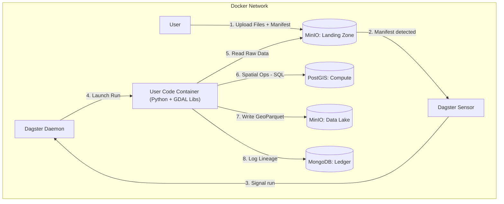

# Spatial Data ETL Pipeline

An automated, containerized ETL pipeline specialized for processing spatial data (vector and raster) using Dagster, PostGIS, MinIO, and MongoDB.

## Overview

This platform processes spatial data through a strict manifest-based ingestion protocol:

1. **Upload** raw files to MinIO landing zone
2. **Trigger** processing via manifest JSON
3. **Transform** data using PostGIS as a compute engine
4. **Store** processed GeoParquet in the data lake
5. **Track** lineage in MongoDB ledger

## Quick Start

### Prerequisites

- Docker & Docker Compose v2+
- Git

### Setup

```bash
# Clone the repository
git clone <repository-url>
cd data-etl-dagster

# Copy environment template
copy env.example .env

# Start all services
docker compose up -d

# Access the Dagster UI
# Open http://localhost:3000
```

### Service Endpoints

| Service | URL | Credentials |
|---------|-----|-------------|
| Dagster UI | http://localhost:3000 | - |
| MinIO Console | http://localhost:9001 | See .env |
| MinIO API | http://localhost:9000 | See .env |
| MongoDB | localhost:27017 | See .env |
| PostGIS | localhost:5432 | See .env |

## Architecture



## Repository Structure

```
data-etl-dagster/
├── CONTEXT.md              # Global architecture context
├── docker-compose.yaml     # Service orchestration
├── services/
│   ├── dagster/           # Dagster orchestrator
│   ├── minio/             # Object storage config
│   ├── mongodb/           # Metadata store config
│   └── postgis/           # Compute engine config
├── libs/
│   ├── spatial_utils/     # GDAL wrappers
│   └── models/            # Pydantic schemas
└── configs/               # Configuration templates
```

## Documentation

Each component has its own `CONTEXT.md` with detailed documentation:

- [Global Context](./CONTEXT.md) - Architecture and philosophy
- [Dagster](./services/dagster/CONTEXT.md) - Orchestration layer
- [MinIO](./services/minio/CONTEXT.md) - Object storage
- [MongoDB](./services/mongodb/CONTEXT.md) - Metadata ledger
- [PostGIS](./services/postgis/CONTEXT.md) - Compute engine
- [Spatial Utils](./libs/spatial_utils/CONTEXT.md) - GDAL wrappers
- [Models](./libs/models/CONTEXT.md) - Data schemas

## Development

### Local Development

```bash
# Start services in development mode
docker compose up -d

# View logs
docker compose logs -f dagster-webserver

# Rebuild after code changes
docker compose up -d --build user-code
```

### Testing

The project includes both unit tests (no services required) and integration tests (requires Docker stack).

#### Prerequisites

```bash
# Install test dependencies
pip install -r requirements-test.txt
```

#### Unit Tests

Unit tests validate Pydantic models and business logic without requiring running services:

```bash
# Run unit tests only
pytest tests/unit -v
```

#### Integration Tests

Integration tests verify connectivity and basic operations against running services. These require the Docker stack to be running.

**1. Start the Docker stack:**

```bash
# Start all services required for integration tests
docker compose -f docker-compose.yaml up -d --build \
  dagster-webserver dagster-daemon user-code minio minio-init mongodb postgis dagster-postgres
```

**2. Wait for services to be ready:**

```bash
# Wait for all services to become healthy
python scripts/wait_for_services.py
```

This script polls each service (MinIO, MongoDB, PostGIS, Dagster) until they're ready or timeout is reached.

**3. Run integration tests:**

```bash
# Run integration tests
pytest -m integration tests/integration -v
```

**4. Stop the Docker stack:**

```bash
# Stop and remove containers and volumes
docker compose -f docker-compose.yaml down -v
```

#### Running All Tests

```bash
# Run unit tests first
pytest tests/unit -v

# Then run integration tests (if Docker stack is running)
pytest -m integration tests/integration -v
```

#### Test Structure

- `tests/unit/` - Unit tests (no external dependencies)
- `tests/integration/` - Integration tests (requires Docker stack)
  - `test_minio.py` - MinIO connectivity and operations
  - `test_mongodb.py` - MongoDB connectivity and CRUD
  - `test_postgis.py` - PostGIS connectivity and spatial functions
  - `test_dagster.py` - Dagster GraphQL API connectivity

## License

[Add license information]

