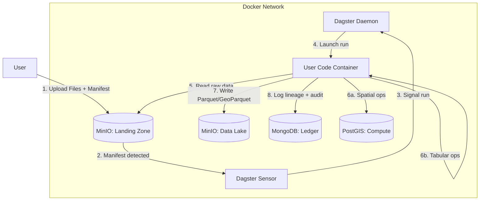

# Architecture (High Level)

This is a conceptual flow; consult service-level AGENTS for implementation detail.

```mermaid
graph TD
    subgraph "Docker Network"
        Daemon[Dagster Daemon]
        Sensor[Dagster Sensor]
        CodeLoc[User Code Container]

        Landing[(MinIO: Landing Zone)]
        Lake[(MinIO: Data Lake)]
        Mongo[(MongoDB: Ledger)]
        PostGIS[(PostGIS: Compute)]
    end

    User -->|1. Upload Files + Manifest| Landing
    Landing -->|2. Manifest detected| Sensor
    Sensor -->|3. Signal run| Daemon
    Daemon -->|4. Launch run| CodeLoc
    CodeLoc -->|5. Read raw data| Landing
    CodeLoc -->|6a. Spatial ops| PostGIS
    CodeLoc -->|6b. Tabular ops| CodeLoc
    CodeLoc -->|7. Write Parquet/GeoParquet| Lake
    CodeLoc -->|8. Log lineage + audit| Mongo
```
