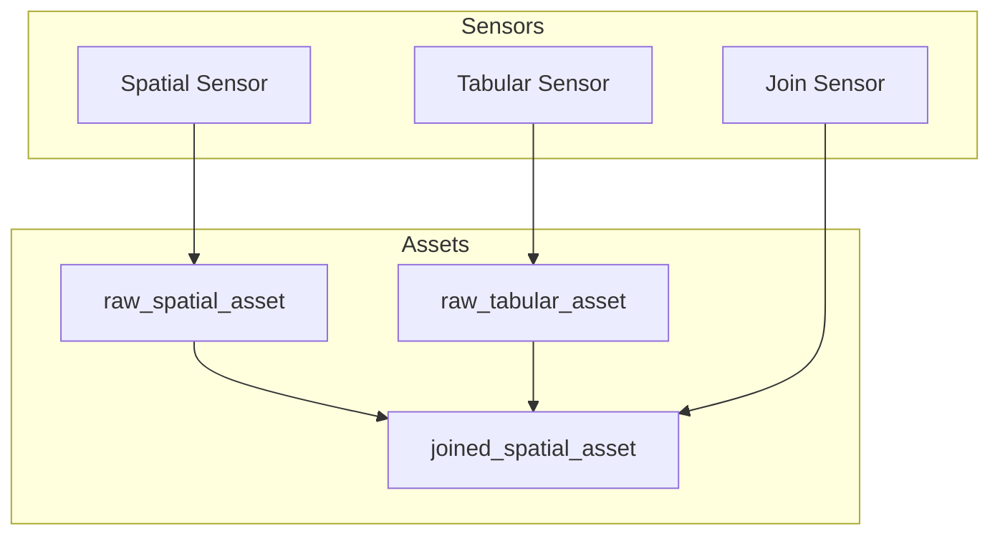

# etl_pipelines/ — Agent Guide

> **Generated**: 2026-01-07 | **Commit**: f7dcb0c

## What this directory is / owns

This is the **Dagster code location** — the heart of the ETL platform. Contains all assets, ops, sensors, resources, and jobs that implement the Load → Transform → Export pipeline.

## Key invariants / non-negotiables

- **Register everything in `definitions.py`**: new assets/jobs/sensors/resources MUST be added here
- **Assets use dynamic partitions**: all ingestion assets partitioned by `dataset_id`
- **PostGIS is transient**: ops MUST clean up ephemeral schemas (use `ephemeral_schema` context manager)
- **Sensors are one-shot**: cursor tracks processed manifests; no auto-retry on failure
- **Audit Logging**: Runs are tagged with `operator` and lifecycle events are logged to the `activity_logs` collection.

## Architecture



## Structure

```
etl_pipelines/
├── definitions.py      # ★ Central registration (Definitions object)
├── partitions.py       # DynamicPartitionsDefinition for dataset_id
├── assets/             # Software-defined assets
│   ├── base_assets.py      # raw_manifest_json, raw_spatial_asset, raw_tabular_asset
│   ├── joined_assets.py    # joined_spatial_asset
│   └── health_checks.py    # gdal_health_check
├── ops/                # Operations (helper functions for assets)
│   ├── load_op.py          # _load_files_to_postgis
│   ├── transform_op.py     # _spatial_transform
│   ├── export_op.py        # _export_to_datalake
│   ├── tabular_ops.py      # CSV→Parquet pipeline
│   ├── join_ops.py         # Spatial+tabular join logic
│   ├── cleanup_op.py       # Schema cleanup
│   └── common_ops.py       # Shared utilities
├── sensors/            # Manifest detection & routing
│   ├── manifest_sensor.py  # LEGACY: routes to ingest_job
│   ├── spatial_sensor.py   # → spatial_asset_job
│   ├── tabular_sensor.py   # → tabular_asset_job
│   ├── join_sensor.py      # → join_asset_job
│   └── run_status_sensor.py # Lifecycle: success/failure → MongoDB
├── resources/          # External service wrappers
│   ├── minio_resource.py   # MinIO client (landing/lake)
│   ├── mongodb_resource.py # MongoDB ledger operations
│   ├── postgis_resource.py # PostGIS ephemeral compute
│   └── gdal_resource.py    # GDAL subprocess wrapper
└── jobs/               # Legacy op-based jobs
    └── ingest_job.py       # Op-based ingest (backwards compat)
```

## Jobs & Sensors Routing

| Intent | Sensor | Job | Primary Asset |
|--------|--------|-----|---------------|
| `ingest_vector` | `spatial_sensor` | `spatial_asset_job` | `raw_spatial_asset` |
| `ingest_raster` | `spatial_sensor` | `spatial_asset_job` | `raw_spatial_asset` |
| `ingest_tabular` | `tabular_sensor` | `tabular_asset_job` | `raw_tabular_asset` |
| `join_datasets` | `join_sensor` | `join_asset_job` | `joined_spatial_asset` |
| Other spatial | `manifest_sensor` | `ingest_job` | (legacy op-based) |

## Asset Graph

```
                    ┌─────────────────────┐
                    │  raw_manifest_json  │  (validation + run init)
                    └─────────────────────┘
                              │
            ┌─────────────────┼─────────────────┐
            ▼                 ▼                 ▼
   ┌─────────────────┐ ┌─────────────────┐ ┌─────────────────┐
   │raw_spatial_asset│ │raw_tabular_asset│ │joined_spatial_  │
   │                 │ │                 │ │     asset       │
   └─────────────────┘ └─────────────────┘ └─────────────────┘
         │                    │                    │
         ▼                    ▼                    ▼
     GeoParquet           Parquet             GeoParquet
     + MongoDB            + MongoDB           + MongoDB
                                              + Lineage
```

## Partitioning

- **Definition**: `partitions.py` exports `dataset_partitions = DynamicPartitionsDefinition(name="dataset_id")`
- **Key extraction**: `extract_partition_key(manifest)` reads `metadata.tags.dataset_id` or generates `dataset_{uuid12}`
- **Registration**: sensors call `context.instance.add_dynamic_partitions()` before yielding `RunRequest`

## Resource Patterns

| Resource | Key Methods | Initialization |
|----------|-------------|----------------|
| `minio` | `list_manifests`, `get_presigned_url`, `move_to_archive` | `EnvVar("MINIO_*")` |
| `mongodb` | `insert_asset`, `insert_run`, `get_manifest` | `EnvVar("MONGO_CONNECTION_STRING")` |
| `postgis` | `ephemeral_schema()`, `execute_sql`, `get_table_bounds` | `EnvVar("POSTGRES_*")` |
| `gdal` | `ogr2ogr()`, `gdal_translate()` | `EnvVar("MINIO_*")` |

## How to work here

- **Add a new asset**:
  1. Create in `assets/`
  2. Use `@asset(partitions_def=dataset_partitions, ...)`
  3. Import and register in `definitions.py`

- **Add a new sensor**:
  1. Create in `sensors/`
  2. Use `@sensor(job=target_job, required_resource_keys={"minio"})`
  3. Register dynamic partition BEFORE yielding `RunRequest`
  4. Import and register in `definitions.py`

- **Add a new resource**:
  1. Extend `ConfigurableResource` in `resources/`
  2. Add to `Definitions(resources={...})` in `definitions.py`

- **Modify ops** (helper functions):
  1. Ops are prefixed with `_` (e.g., `_load_files_to_postgis`)
  2. Called from assets, not exposed as Dagster ops directly
  3. ALWAYS wrap PostGIS work in `try/finally` for cleanup

## Complexity Hotspots

| File | Lines | Why Complex |
|------|-------|-------------|
| `sensors/manifest_sensor.py` | 431 | Cursor management, lane routing, archive logic |
| `ops/join_ops.py` | 497 | Multi-resource coordination, SQL generation |
| `resources/postgis_resource.py` | 481 | Ephemeral schema lifecycle, bounds/geom extraction |

## Anti-patterns (DO NOT)

- **Skip registration**: every asset/job/sensor MUST be in `definitions.py`
- **Store in PostGIS**: transient only; drop schemas after export
- **Forget cleanup**: use `ephemeral_schema()` context manager or `try/finally`
- **Hardcode partition keys**: always use `extract_partition_key()`
- **Yield RunRequest without partition**: register partition first

## Testing

- **Unit tests**: `tests/unit/ops/`, `tests/unit/sensors/`, `tests/unit/resources/`
- **Integration tests**: `tests/integration/test_*_e2e.py`

## Links

- Parent: `../AGENTS.md` (Dagster service)
- Models: `../../../libs/models/AGENTS.md`
- Transformations: `../../../libs/transformations/AGENTS.md`
- Root: `../../../AGENTS.md`
